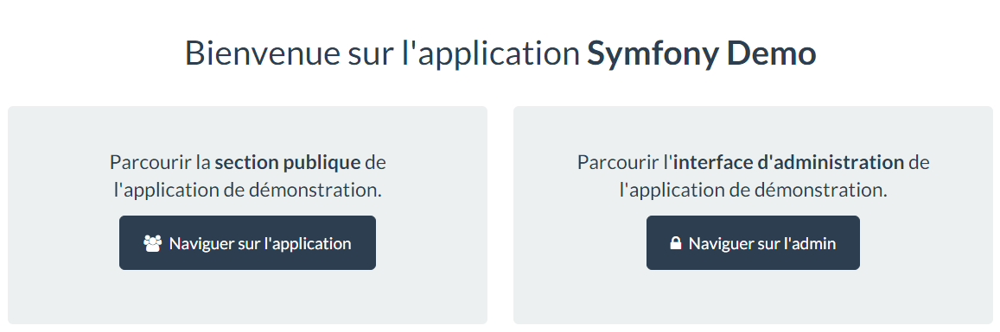

Techlunch Symfony 2
====================

Installation
------------
https://symfony.com/download
http://symfony.com/doc/current/book/installation.html


Cloner le repository github https://github.com/symfony/symfony-demo
ou utiliser l'installeur symfony
```cmd
cd C:\wamp\www
php -r "readfile('http://symfony.com/installer');" > symfony
php symfony demo techlunch-symfony2
```

Lancer le serveur HTTP et la base.

Lancer l'application :
http://localhost/techlunch-symfony2/web/app_dev.php/fr


Voir aussi
http://localhost/techlunch-symfony2/web/app_dev.php/fr/blog/

Le premier chargement est assez long, Symfony construit le cache de l'application.


Passer la base de données sqlite à Mysql en modifiant le fichier app/config/parameter.yml en s'inspirant du fichier app/config/parameter.yml.dist
Par exemple
```mon app/config/parameter.yml
parameters:
    database_driver: pdo_mysql
    database_host: 127.0.0.1
    database_port: ~
    database_name: techlunch_symfony2
    database_user: root
    database_password: null
    database_path: null
```

Créer la base de données
```cmd
php app\console doctrine:database:create
```
Mettre à jour le schéma de la base
```cmd
php app\console doctrine:schema:update --dump-sql
php app\console doctrine:schema:update --force
```
Retourner sur http://localhost/techlunch-symfony2/web/app_dev.php/fr/blog/
Il n'y a plus d'article. 

Recharger les données
```cmd
php app/console doctrine:fixtures:load
```
Cette commande est rappelée sur http://localhost/techlunch-symfony2/web/app_dev.php/fr/login

Retourner sur http://localhost/techlunch-symfony2/web/app_dev.php/fr/blog/
Les articles apparaissent à nouveau.

Ajout d'un bundle
-----
```cmd
php app\console generate:bundle
```


```cmd
  Welcome to the Symfony2 bundle generator


Your application code must be written in bundles. This command helps
you generate them easily.

Each bundle is hosted under a namespace (like Acme/Bundle/BlogBundle).

The namespace should begin with a "vendor" name like your company name
, your
project name, or your client name, followed by one or more optional ca
tegory
sub-namespaces, and it should end with the bundle name itself
(which must have Bundle as a suffix).

See http://symfony.com/doc/current/cookbook/bundles/best_practices.htm
l#index-1 for more
details on bundle naming conventions.

Use / instead of \  for the namespace delimiter to avoid any problem.

Bundle namespace: AbonnementBundle

The namespace sometimes contain a vendor namespace (e.g. VendorName/Bl
ogBundle instead of simply AbonnementBundle).
If you've *did* type a vendor namespace, try using a forward slash / (
Acme/BlogBundle)?

Keep AbonnementBundle as the bundle namespace (choose no to try again)
? [yes]: yes

In your code, a bundle is often referenced by its name. It can be the
concatenation of all namespace parts but it's really up to you to come
up with a unique name (a good practice is to start with the vendor name).
Based on the namespace, we suggest AbonnementBundle.

Bundle name [AbonnementBundle]:

The bundle can be generated anywhere. The suggested default directory uses
the standard conventions.

Target directory [C:\wamp\www\techlunch-symfony2/src]:

Determine the format to use for the generated configuration.

Configuration format (yml, xml, php, or annotation): annotation

To help you get started faster, the command can generate some
code snippets for you.

Do you want to generate the whole directory structure [no]? yes


  Summary before generation


You are going to generate a "AbonnementBundle\AbonnementBundle" bundle
in "C:\wamp\www\techlunch-symfony2/src/" using the "annotation" format.

Do you confirm generation [yes]?


  Bundle generation


Generating the bundle code: OK
Checking that the bundle is autoloaded: OK
Confirm automatic update of your Kernel [yes]?
Enabling the bundle inside the Kernel: OK
Confirm automatic update of the Routing [yes]?
Importing the bundle routing resource: OK


  You can now start using the generated code!
```


Génération d'une entité
-----
```cmd
php app\console generate:doctrine:entity
```


```cmd
  Welcome to the Doctrine2 entity generator


This command helps you generate Doctrine2 entities.

First, you need to give the entity name you want to generate.
You must use the shortcut notation like AcmeBlogBundle:Post.

The Entity shortcut name: AbonnementBundle:Abonne                                                                                             

Determine the format to use for the mapping information.

Configuration format (yml, xml, php, or annotation) [annotation]:

Instead of starting with a blank entity, you can add some fields now.
Note that the primary key will be added automatically (named id).

Available types: array, simple_array, json_array, object,
boolean, integer, smallint, bigint, string, text, datetime, datetimetz,
date, time, decimal, float, binary, blob, guid.

New field name (press <return> to stop adding fields): mail
Field type [string]:
Field length [255]:

New field name (press <return> to stop adding fields): dateEnregistrement
Field type [string]: datetime

New field name (press <return> to stop adding fields):

Do you want to generate an empty repository class [no]? yes


  Summary before generation


You are going to generate a "AbonnementBundle:Abonne" Doctrine2 entity
using the "annotation" format.

Do you confirm generation [yes]?


  Entity generation


Generating the entity code: OK


  You can now start using the generated code!
```


Mise à jour de la base de données
-----
```cmd
php app\console doctrine:schema:update --dump-sql
```

```cmd
CREATE TABLE Abonne (id INT AUTO_INCREMENT NOT NULL, mail VARCHAR(255) NOT NULL, dateEnregistrement DATETIME NOT NULL, PRIMARY KEY(id)) DEFAUL
T CHARACTER SET utf8 COLLATE utf8_unicode_ci ENGINE = InnoDB;
```

```cmd
php app\console doctrine:schema:update --force
```

Génération du crud
-----
```cmd
php app\console generate:doctrine:crud
```

```cmd
  Welcome to the Doctrine2 CRUD generator


This command helps you generate CRUD controllers and templates.

First, you need to give the entity for which you want to generate a CRUD.
You can give an entity that does not exist yet and the wizard will help
you defining it.

You must use the shortcut notation like AcmeBlogBundle:Post.

The Entity shortcut name: AbonnementBundle:Abonne

By default, the generator creates two actions: list and show.
You can also ask it to generate "write" actions: new, update, and delete.

Do you want to generate the "write" actions [no]? yes

Determine the format to use for the generated CRUD.

Configuration format (yml, xml, php, or annotation) [annotation]:

Determine the routes prefix (all the routes will be "mounted" under this
prefix: /prefix/, /prefix/new, ...).

Routes prefix [/abonne]: /abonnement


  Summary before generation


You are going to generate a CRUD controller for "AbonnementBundle:Abonne"
using the "annotation" format.

Do you confirm generation [yes]?


  CRUD generation


Generating the CRUD code: OK
Generating the Form code: OK


  You can now start using the generated code!
```

L'URL http://localhost/techlunch-symfony2/web/app_dev.php/abonnement/ est maintenant disponible.

Formulaire d'ajout : 


Liste des éléments ajoutés :


Ajout de la validation
-----

On ajoute les annotations de validation de format, d'unicité et l'ajout d'événement sur l'entité Abonne.

Mettre à jour la base pour prendre en compte la contrainte d'unicité :
```cmd
techlunch-symfony2>php app\console doctrine:schema:update --dump-sql
```

```cmd
CREATE UNIQUE INDEX UNIQ_719E8EC65126AC48 ON abonne (mail);
```

```cmd
techlunch-symfony2>php app\console doctrine:schema:update --force
```

Retourner sur le formulaire http://localhost/techlunch-symfony2/web/app_dev.php/abonnement/new et saisisser une adresse mail déjà existante :


Le conteneur de service
-----
http://symfony.com/doc/current/book/service_container.html

The service container helps you instantiate, organize and retrieve the many objects of your application.
The container makes your life easier, is super fast, and emphasizes an architecture that promotes reusable and decoupled code.

In large part, the service container is the biggest contributor to the speed and extensibility of Symfony.

Envoyer un mail
-----
http://symfony.com/doc/current/cookbook/email/email.html